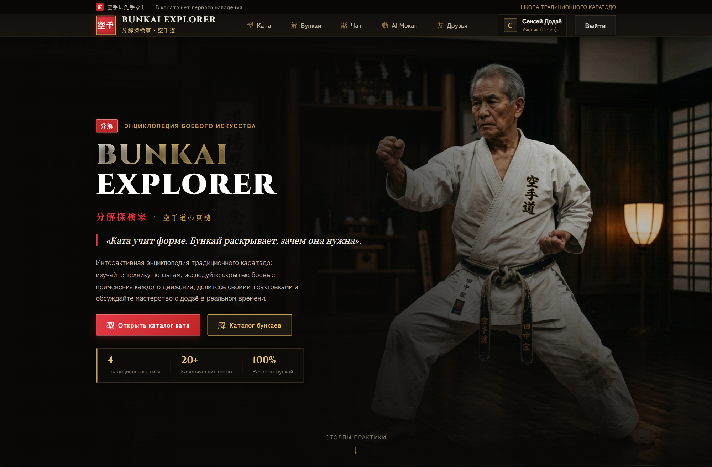
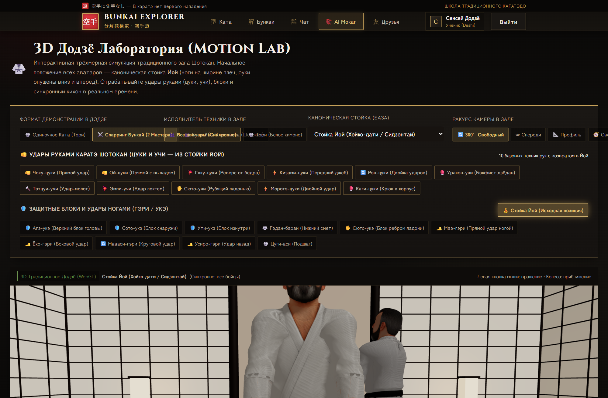
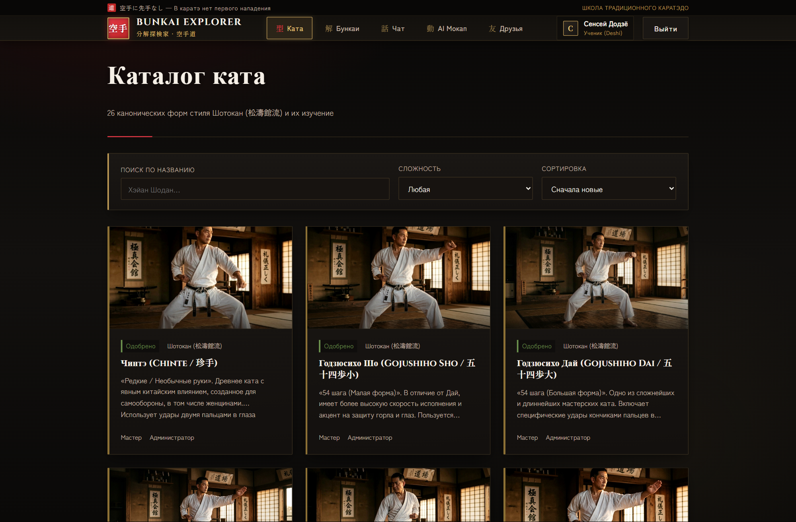
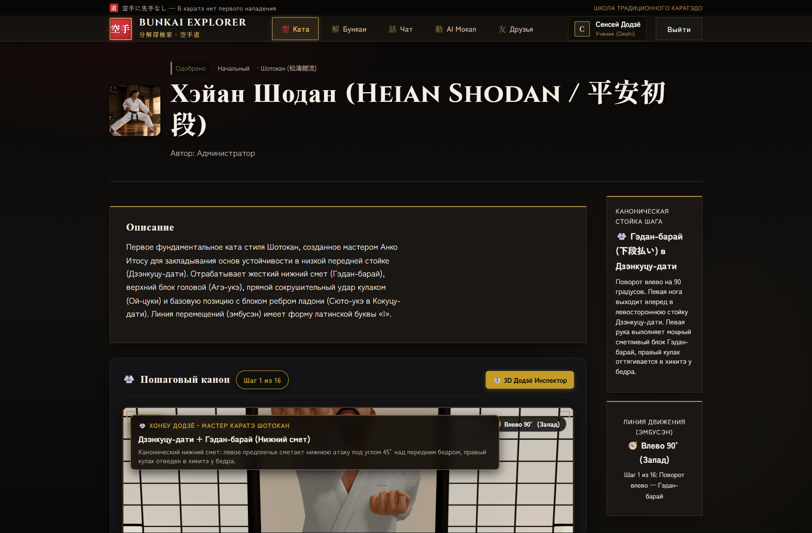
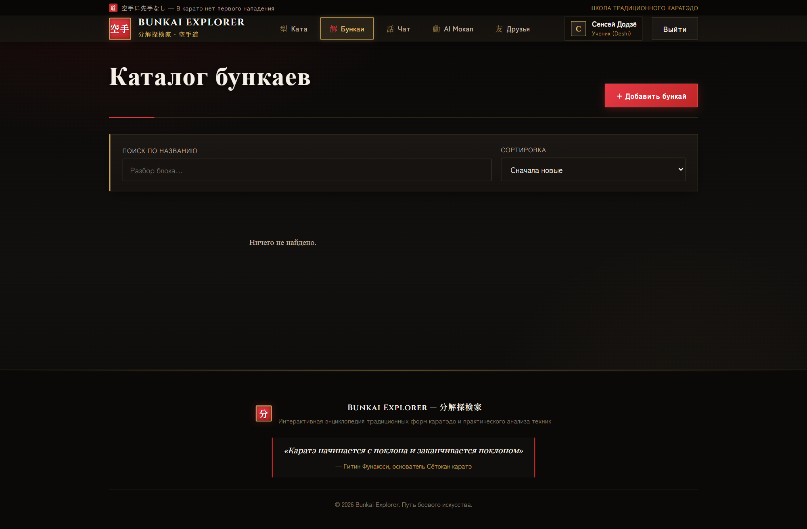
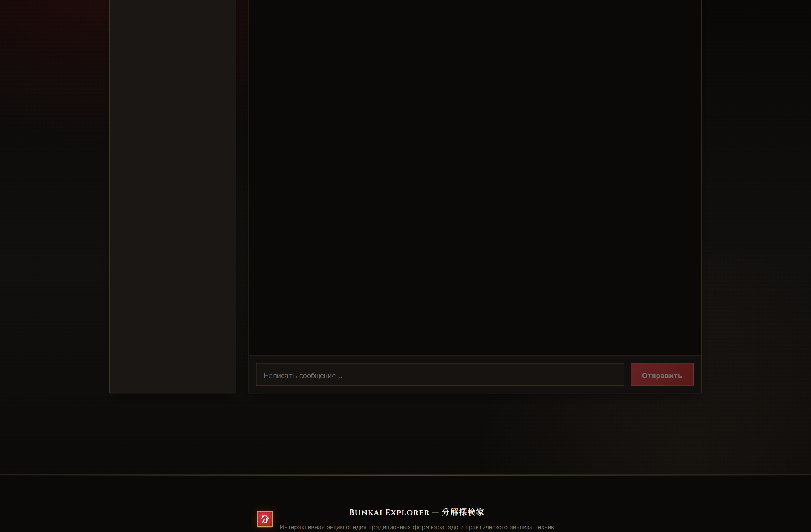
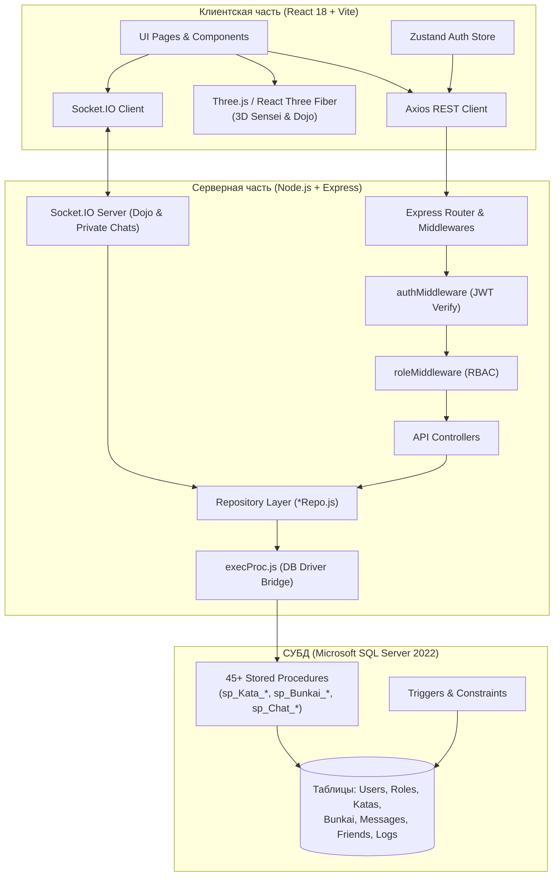

# 🥋 Bunkai Explorer · 分解探検家
### Интерактивная веб-платформа для изучения карате, прикладного анализа техник (бункай) и 3D-визуализации движений

<p align="center">
  
</p>

<p align="center">
  
  
  
  
  
  
</p>

---

## 📌 О проекте

**Bunkai Explorer** — дипломный программный комплекс, объединяющий современный веб-стек, интерактивную 3D-графику и строгую реляционную архитектуру баз данных для глубокого изучения традиционного боевого искусства (Шотокан карате-до). 

Платформа решает ключевую проблему понимания боевых искусств: переход от формальных комплексов (**Ката**) к их практическому боевому применению (**Бункай**). Интерактивный 3D-сенсей в аутентичном виртуальном Додзё позволяет рассматривать стойки, удары и блоки со всех ракурсов, управлять скоростью анимации и разбирать боевые связки.

---

## 🖥️ Интерфейс приложения

### 🥋 3D Motion Lab & Виртуальное Додзё
* **Процедурное 3D Додзё** — традиционный японский зал с татами, деревянными балками, сёдзи и атмосферным освещением на Three.js / React Three Fiber.
* **Реалистичный 3D Сенсей** — детальная модель мастера в карате-ги с черным поясом и скелетной анимацией.
* **Библиотека стоек и ударов**:
  * *Стойки (Дачи)*: Шидзентай (Ёй), Дзенкуцу-дачи, Киба-дачи, Кокуцу-дачи, Фудо-дачи, Ганкаку-дачи.
  * *Удары руками (Цуки/Учи)*: Чоку-дзуки, Гяку-дзуки, Ой-дзуки, Кизами-дзуки, Рен-дзуки, Мороте-дзуки, Эмпи-учи, Уракен-учи, Тетцуи-учи, Шуто-учи.
  * *Блоки (Уке)*: Агэ-уке, Гэдан-барай, Сото-уке, Учи-уке, Шуто-уке.
  * *Удары ногами (Гери)*: Маэ-гери, Маваши-гери, Йоко-гери, Уширо-гери.
* **Интерактивное управление**: вращение камеры 360°, плавный зум, пауза/воспроизведение, контроль скорости (0.25x – 2.0x), пошаговая навигация.

<p align="center">
  
</p>

---

### 📚 Интерактивный каталог 26 Ката Шотокан
* Полный иллюстрированный реестр всех 26 официальных ката Шотокан (от *Heian Shodan* до *Unsu* и *Gojushiho Dai*).
* Пошаговый разбор движений с таймингами, ключевыми акцентами и видео-вставками.
* Гибкий поиск, фильтрация по сложности (ученические, мастерские), тегам и авторам.

<p align="center">
  
</p>

---

### 🔍 Детальный разбор Ката и шагов техники
* Подробные карточки каждого шага ката с указанием стойки, направления, типа блока или удара.
* Интегрированный видеоплеер для синхронного изучения движений.

<p align="center">
  
</p>

---

### 📖 Каталог Бункаев (прикладных расшифровок)
* Публикация и изучение практических боевых расшифровок элементов ката.
* Система комментариев, обсуждений и модерации материалов сообщества.

<p align="center">
  
</p>

---

### 💬 Real-Time Сообщество и Чат Додзё
* **Общий чат Додзё** для открытого общения всех практикующих в реальном времени.
* **Приватные диалоги (1-на-1)** между подтвержденными друзьями.
* **Система друзей**: поиск пользователей, отправка, подтверждение, отклонение заявок.
* Надежная аутентификация WebSocket-соединения по JWT и автопереподключение на базе Socket.IO.

<p align="center">
  
</p>

---

## 🛡️ Безопасность и Архитектура Доступа (Guest-Gating)

* **Строгая трехролевая модель**: `guest`, `user`, `admin`.
* **Guest-Gating**: неавторизованные посетители не имеют доступа к содержимому платформы — автоматический редирект на регистрацию/вход. Сервер возвращает `401 Unauthorized` на любые защищенные эндпоинты при отсутствии токена.
* **JWT Access + httpOnly Refresh Cookie** с автоматической ротацией токенов.
* Защита от эскалации привилегий: пользователи не могут повысить себе роль через клиентское API.

---

## ⚙️ Архитектура базы данных Zero-SQL (MSSQL Stored Procedures)

* **Сервер не генерирует сырой SQL**. Вся бизнес-логика (права, видимость по ролям, защита от накруток, каскады, модерация, аудит) полностью инкапсулирована в Microsoft SQL Server.
* **~45 хранимых процедур, 3 пользовательские функции и триггеры автообновления**.
* Единая точка вызова `execProc.js` транслирует ошибки процедур формата `ERR|<HTTP-код>|<сообщение>` в типизированные HTTP-ответы API.

---

## 🏛️ Архитектура системы



---

## 💻 Технологический стек

| Уровень | Технологии | Назначение |
|---|---|---|
| **Frontend** | React 18, Vite 5, React Router 6 | Компонентная структура SPA и клиентский роутинг |
| **3D Графика** | Three.js, `@react-three/fiber`, `@react-three/drei` | 3D-сцена Додзё, скелетная анимация сенсея, освещение |
| **Стейт & Анимации** | Zustand, Framer Motion | Глобальное состояние авторизации и плавные UI-переходы |
| **Стилизация** | Custom CSS (Japanese Dark Aesthetic, Gold Accents) | Адаптивный темный тематический интерфейс |
| **Backend** | Node.js 18+, Express 4, Helmet, Morgan | REST API сервер, CORS, безопасность HTTP-заголовков |
| **Реалтайм** | Socket.IO 4.7 (Client & Server) | Двусторонний транспорт сообщений чатов |
| **Аутентификация** | JWT (`jsonwebtoken`), `bcryptjs`, Cookie-Parser | Access/Refresh токены, безопасное хеширование |
| **База данных** | Microsoft SQL Server (MSSQL), `tedious`, `sequelize` | Реляционная СУБД, выполнение хранимых процедур |

---

## 🚀 Быстрый старт

### Требования
* **Node.js** версии 18 или выше
* **npm** версии 9+
* **Microsoft SQL Server**

---

### 1. Инициализация базы данных

Примените файлы схемы, триггеров и процедур к вашему серверу MSSQL (через `sqlcmd` или SQL Server Management Studio):

```bash
sqlcmd -S localhost -U sa -P '<пароль>' -Q "CREATE DATABASE BunkaiExplorer"
sqlcmd -S localhost -U sa -P '<пароль>' -d BunkaiExplorer -i database/schema.sql
sqlcmd -S localhost -U sa -P '<пароль>' -d BunkaiExplorer -i database/triggers.sql
sqlcmd -S localhost -U sa -P '<пароль>' -d BunkaiExplorer -i database/procedures.sql
```

---

### 2. Запуск Backend (`/server`)

```bash
cd server
npm install
npm run dev
```

Сервер API и сокетов будет запущен по адресу: `http://localhost:5000`

---

### 3. Запуск Frontend (`/client`)

```bash
cd client
npm install
npm run dev
```

Клиентское веб-приложение откроется по адресу: `http://localhost:5173`

---

## 📁 Структура проекта

```
Graduation_Project/
├── client/                               # Фронтенд (React 18 + Vite)
│   ├── public/
│   │   ├── anims/                        # JSON-файлы скелетных анимаций карате
│   │   ├── images/kata/                  # Иллюстрации и схемы ката
│   │   └── models/                       # 3D-модель сенсея (sensei.fbx) и текстуры
│   └── src/
│       ├── api/                          # Axios-клиент и эндпоинты
│       ├── components/                   # Повторно используемые UI-компоненты
│       ├── hooks/                        # Кастомные React-хуки (useChatSocket)
│       ├── layouts/                      # Layouts и RouteGuards (Guest-Gating)
│       ├── pages/                        # Страницы приложения
│       │   ├── admin/                    # Панель администратора
│       │   ├── MotionLabPage.jsx         # 3D-лаборатория стоек и ударов
│       │   ├── KataDetailPage.jsx       # Страница ката с пошаговым разбором
│       │   ├── BunkaiCatalog.jsx         # Каталог бункаев
│       │   └── ChatPage.jsx              # Общий и личный чат (Socket.IO)
│       ├── store/                        # Хранилище Zustand (authStore)
│       └── three/                        # 3D-сцены: Dojo, KaratekaAvatar, BunkaiDuelScene
├── database/                             # База данных MSSQL
│   ├── schema.sql                        # DDL: таблицы, связи, внешние ключи, индексы
│   ├── triggers.sql                      # Триггеры обновления дат и счетчиков
│   ├── procedures.sql                    # ~45 хранимых процедур (вся бизнес-логика)
│   └── seed.template.sql                 # Шаблон начального наполнения
├── docs/                                 # Документация проекта
│   ├── screenshots/                      # Реальные скриншоты интерфейса
│   └── api.md                            # Спецификация REST API и кодов ошибок
├── server/                               # Бэкенд (Node.js + Express)
│   ├── server.js                         # Точка входа HTTP и Socket.IO
│   └── src/
│       ├── controllers/                  # Контроллеры маршрутов
│       ├── db/                           # execProc.js и сущностные репозитории (*Repo.js)
│       ├── middlewares/                  # JWT auth, проверка ролей, multer, обработка ошибок
│       ├── routes/                       # Express-роуты (/api/auth, /api/kata, etc.)
│       ├── services/                     # Сервисы (authService, backupService, mediaService)
│       └── sockets/                      # Обработчики событий Socket.IO (chatSocket.js)
├── uploads/                              # Локальное хранилище аватаров и медиа
└── README.md                             # Документация проекта
```

---

## 🧪 Сценарии проверки

1. **Проверка Guest-Gating**: Откройте `http://localhost:5173/` без авторизации — приложение автоматически выполнит редирект на `/register`. Запрос к API без токена возвращает `401 Unauthorized`.
2. **Регистрация и Вход**: Зарегистрируйте аккаунт на странице `/register`. Пользователь получает доступ к каталогам и личному кабинету.
3. **3D Motion Lab**: В разделе *Motion Lab* доступно управление 3D-моделью мастера в японском додзё, переключение стоек (*Zenkutsu-dachi*, *Kiba-dachi*) и ударов (*Gyaku-zuki*, *Mae-geri*), а также регулировка скорости анимации.
4. **Каталог Ката и Бункай**: Просмотр списка 26 ката Шотокан, переход на страницу с разбором шагов техники и видеоматериалами.
5. **Real-Time Чат**: Откройте чат Додзё и отправьте сообщение — доставка участникам происходит мгновенно по WebSocket (Socket.IO).
