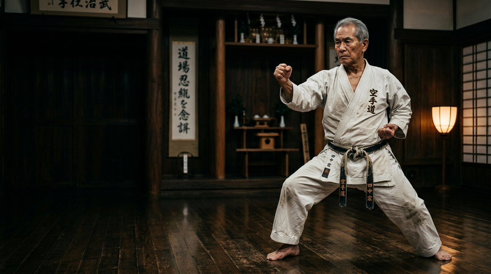
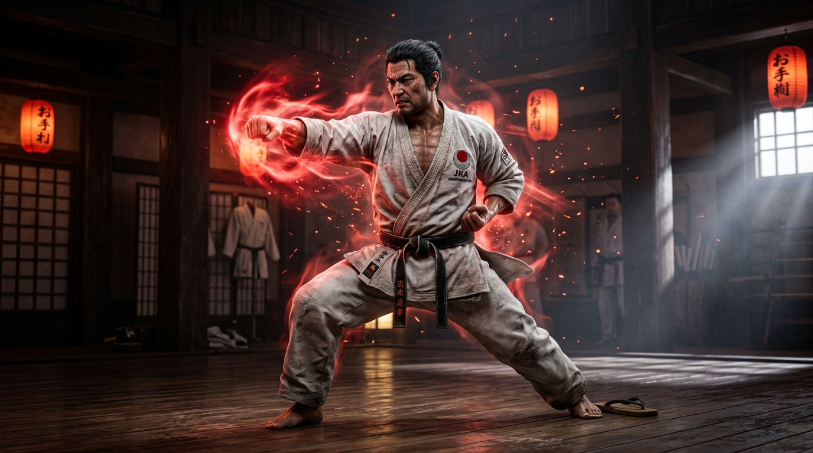
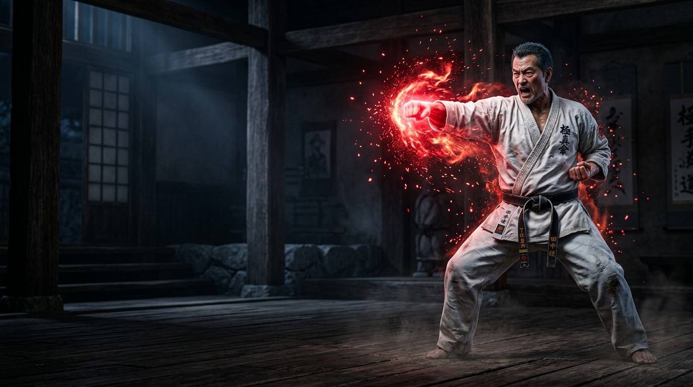
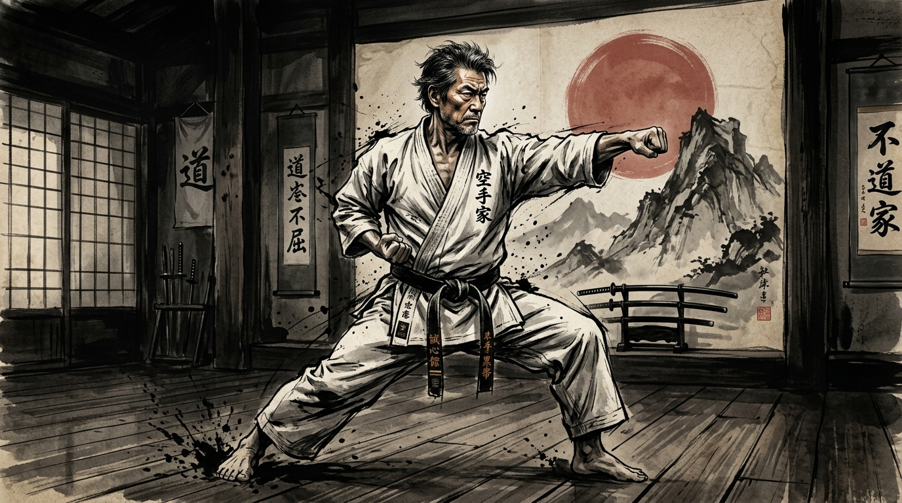
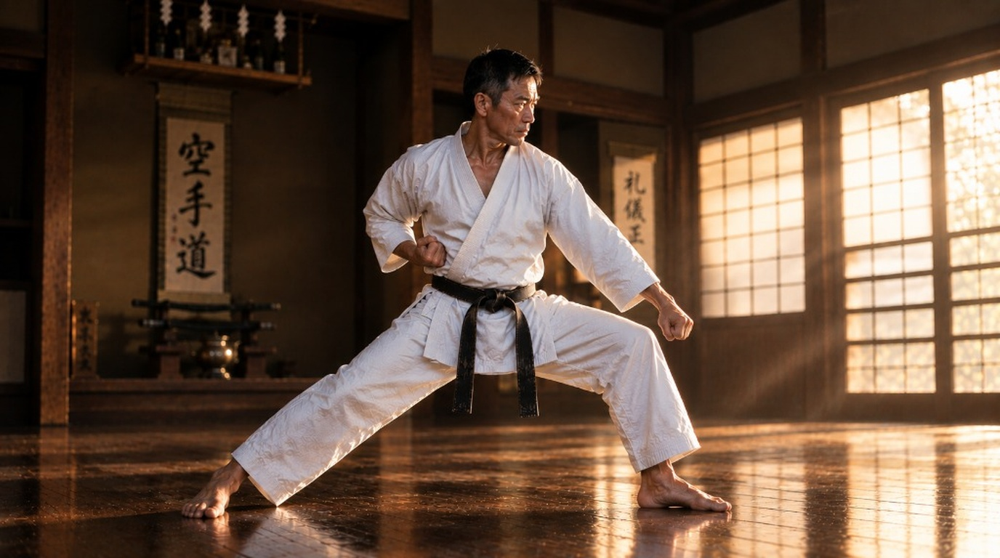
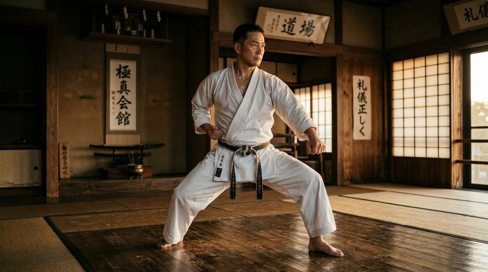
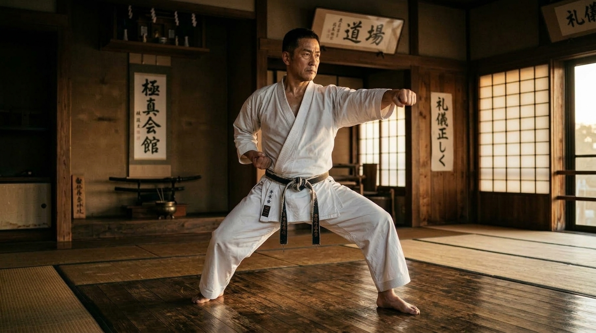
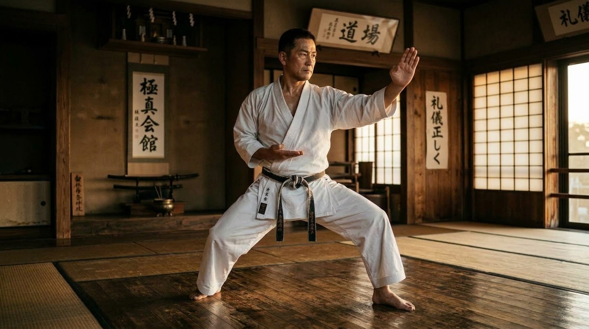
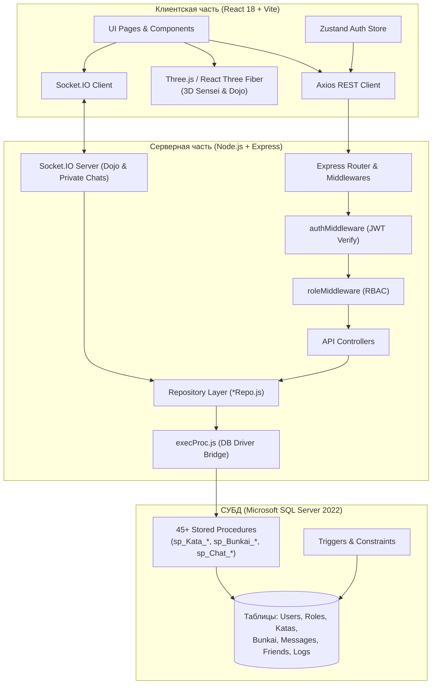

# 🥋 Bunkai Explorer · 分解探検家
### Интерактивная веб-платформа для изучения карате, прикладного анализа техник (бункай) и 3D-визуализации движений

<p align="center">
  
</p>

<p align="center">
  
  
  
  
  
  
  
</p>

---

## 📌 О проекте

**Bunkai Explorer** — дипломный программный комплекс, объединяющий современный веб-стек, интерактивную 3D-графику и строгую реляционную архитектуру баз данных для глубокого изучения традиционного боевого искусства (Шотокан карате-до). 

Платформа решает ключевую проблему понимания боевых искусств: переход от формальных комплексов (**Ката**) к их практическому боевому применению (**Бункай**). Интерактивный 3D-сенсей в аутентичном виртуальном Додзё позволяет рассматривать стойки, удары и блоки со всех ракурсов, управлять скоростью анимации и разбирать боевые связки.

---

## ✨ Ключевые возможности

### 🥋 3D Motion Lab & Виртуальное Додзё
* **Процедурное 3D Додзё** — традиционный японский зал с татами, деревянными балками, сёдзи и атмосферным освещением на Three.js / React Three Fiber.
* **Реалистичный 3D Сенсей** — детальная модель мастера в карате-ги с черным поясом и скелетной анимацией.
* **Библиотека стоек и ударов**:
  * *Стойки (Дачи)*: Шидзентай (Ёй), Дзенкуцу-дачи, Киба-дачи, Кокуцу-дачи, Фудо-дачи, Ганкаку-дачи.
  * *Удары руками (Цуки/Учи)*: Чоку-дзуки, Гяку-дзуки, Ой-дзуки, Кизами-дзуки, Рен-дзуки, Мороте-дзуки, Эмпи-учи, Уракен-учи, Тетцуи-учи, Шуто-учи.
  * *Блоки (Уке)*: Агэ-уке, Гэдан-барай, Сото-уке, Учи-уке, Шуто-уке.
  * *Удары ногами (Гери)*: Маэ-гери, Маваши-гери, Йоко-гери, Уширо-гери.
* **Интерактивное управление**: вращение камеры 360°, плавный зум, пауза/воспроизведение, контроль скорости (0.25x – 2.0x), пошаговая навигация.
* **Bunkai Duel Scene** — интерактивная сцена парного взаимодействия (атакующий и защищающийся).

<p align="center">
  
  
  
</p>

### 📚 Интерактивный каталог 26 Ката Шотокан и Бункай
* Полный иллюстрированный реестр всех 26 официальных ката Шотокан (от *Heian Shodan* до *Unsu* и *Gojushiho Dai*).
* Пошаговый разбор движений с таймингами, ключевыми акцентами и видео-вставками (YouTube / локальное видео).
* Пользовательские бункаи: публикация разборов применения техник с поддержкой модерации сообщества.
* Гибкий поиск, фильтрация по сложности (ученические, мастерские), тегам и авторам.

<p align="center">
  
  
  
  
</p>

### 💬 Real-Time Сообщество и Чат (Socket.IO)
* **Общий чат Додзё** для открытого общения всех практикующих.
* **Приватные диалоги (1-на-1)** между подтвержденными друзьями.
* **Система друзей**: поиск пользователей, отправка, подтверждение, отклонение заявок, предотвращение дубликатов и самозаявок.
* Надежная аутентификация WebSocket-хэндшейка по JWT, автоматическое переподключение и защита от спама.

### 🛡️ Безопасность и Архитектура Доступа (Guest-Gating)
* **Строгая трехролевая модель**: `guest`, `user`, `admin`.
* **Guest-Gating**: неавторизованные гости не имеют доступа к контенту — автоматический редирект на регистрацию/вход. Сервер возвращает `401 Unauthorized` на любые защищенные маршруты.
* **JWT Access + httpOnly Refresh Cookie** с автоматической ротацией токенов.
* Защита от эскалации привилегий: пользователи не могут повысить себя до роли `admin` через API.

### ⚙️ Архитектура базы данных Zero-SQL (MSSQL Stored Procedures)
* **Сервер не генерирует сырой SQL**. Вся бизнес-логика (права, видимость по ролям, защита от накруток, каскады, модерация, аудит) полностью инкапсулирована в Microsoft SQL Server.
* **~45 хранимых процедур, 3 пользовательские функции и триггеры автообновления**.
* Единая точка вызова `execProc.js` транслирует ошибки процедур формата `ERR|<HTTP-код>|<сообщение>` в типизированные HTTP-ответы API.

### 🛠️ Панель администратора
* **Модерация контента**: очередь входящих ката и бункаев (`pending` → `approved` / `rejected`).
* **Управление пользователями**: поиск, блокировка, смена ролей, удаление.
* **Журнал действий (Activity Logs)**: полный аудит критических системных операций.
* **Менеджер резервного копирования**: создание реальных бэкапов базы данных через `sqlcmd` с логированием статуса.

---

## 🏛️ Архитектура системы



---

## 💻 Технологический стек

| Уровень | Технологии | Назначение |
|---|---|---|
| **Frontend** | React 18, Vite 5, React Router 6 | Компонентная структура SPA и клиентский роутинг |
| **3D Графика** | Three.js, `@react-three/fiber`, `@react-three/drei` | 3D-сцена Додзё, скелетная анимация сенсея, освещение |
| **Стейт & Анимации** | Zustand, Framer Motion | Глобальное состояние авторизации и плавные UI-переходы |
| **Стилизация** | Custom CSS (Japanese Dark Aesthetic, Gold Accents) | Адаптивный тематический интерфейс |
| **Backend** | Node.js 18+, Express 4, Helmet, Morgan | REST API сервер, CORS, безопасность HTTP-заголовков |
| **Реалтайм** | Socket.IO 4.7 (Client & Server) | Двусторонний транспорт сообщений чатов |
| **Аутентификация** | JWT (`jsonwebtoken`), `bcryptjs`, Cookie-Parser | Access/Refresh токены, безопасное хеширование |
| **База данных** | Microsoft SQL Server (MSSQL), `tedious`, `sequelize` | Реляционная СУБД, выполнение хранимых процедур |
| **Контейнеризация** | Docker, Docker Compose | Воспроизводимый запуск базы и сервисов в изоляции |

---

## 🚀 Быстрый старт

### Требования
* **Node.js** версии 18 или выше
* **npm** версии 9+
* **Docker & Docker Compose** (для запуска MSSQL в контейнере) ИЛИ локально установленный **Microsoft SQL Server**

---

### Вариант 1. Запуск базы данных в Docker (рекомендуется)

1. Запустите контейнер с Microsoft SQL Server:
```bash
docker compose up mssql -d
```

2. Инициализируйте схему базы данных и процедуры:
```bash
# Применение схемы, триггеров и процедур
sqlcmd -S localhost -U sa -P 'YourStrong@Passw0rd' -Q "CREATE DATABASE BunkaiExplorer"
sqlcmd -S localhost -U sa -P 'YourStrong@Passw0rd' -d BunkaiExplorer -i database/schema.sql
sqlcmd -S localhost -U sa -P 'YourStrong@Passw0rd' -d BunkaiExplorer -i database/triggers.sql
sqlcmd -S localhost -U sa -P 'YourStrong@Passw0rd' -d BunkaiExplorer -i database/procedures.sql
```

3. Сгенерируйте и примените сиды начальных данных:
```bash
cd server
npm install
npm run seed:sql
sqlcmd -S localhost -U sa -P 'YourStrong@Passw0rd' -d BunkaiExplorer -i ../database/seed.sql
```

---

### Вариант 2. Запуск приложения целиком через Docker Compose

```bash
docker compose up --build
```

---

### Локальная разработка (Backend & Frontend)

#### Запуск Backend (`/server`):
```bash
cd server
npm install
npm run dev
```
Сервер будет доступен по адресу: `http://localhost:5000`

#### Запуск Frontend (`/client`):
```bash
cd client
npm install
npm run dev
```
Клиент откроется по адресу: `http://localhost:5173`

---

## 🔑 Учетные записи по умолчанию (Seed)

После применения `seed.sql` в системе доступны следующие тестовые аккаунты:

| Логин | Пароль | Роль | Возможности |
|---|---|---|---|
| `admin` | `Admin#12345` | **admin** | Полный доступ: админ-панель, модерация ката/бункаев, управление пользователями, просмотр логов, бэкапы |
| `demo_user` | `Demo#12345` | **user** | Стандартный доступ: просмотр ката, публикация бункаев, добавление в друзья, общий и личные чаты |

---

## 📁 Структура проекта

```
Graduation_Project/
├── client/                               # Фронтенд (React 18 + Vite)
│   ├── public/
│   │   ├── anims/                        # JSON-файлы скелетных анимаций карате
│   │   ├── images/kata/                  # Иллюстрации и схемы ката
│   │   └── models/                       # 3D-модель сенсея (sensei.fbx) и текстуры
│   └── src/
│       ├── api/                          # Axios-клиент и эндпоинты
│       ├── components/                   # Повторно используемые UI-компоненты
│       ├── hooks/                        # Кастомные React-хуки (useChatSocket)
│       ├── layouts/                      # Layouts и RouteGuards (Guest-Gating)
│       ├── pages/                        # Страницы приложения
│       │   ├── admin/                    # Панель администратора (пользователи, модерация, логи, бэкапы)
│       │   ├── MotionLabPage.jsx         # 3D-лаборатория стоек и ударов
│       │   ├── KataDetailPage.jsx       # Страница ката с пошаговым разбором
│       │   └── ChatPage.jsx              # Общий и личный чат (Socket.IO)
│       ├── store/                        # Хранилище Zustand (authStore)
│       └── three/                        # 3D-сцены: Dojo, KaratekaAvatar, BunkaiDuelScene
├── database/                             # База данных MSSQL
│   ├── schema.sql                        # DDL: таблицы, связи, внешние ключи, индексы
│   ├── triggers.sql                      # Триггеры обновления дат и счетчиков
│   ├── procedures.sql                    # ~45 хранимых процедур (вся бизнес-логика)
│   └── seed.template.sql                 # Шаблон начального наполнения
├── docs/                                 # Документация проекта
│   └── api.md                            # Спецификация REST API и кодов ошибок
├── server/                               # Бэкенд (Node.js + Express)
│   ├── server.js                         # Точка входа HTTP и Socket.IO
│   └── src/
│       ├── controllers/                  # Контроллеры маршрутов
│       ├── db/                           # execProc.js и сущностные репозитории (*Repo.js)
│       ├── middlewares/                  # JWT auth, проверка ролей, multer, обработка ошибок
│       ├── routes/                       # Express-роуты (/api/auth, /api/kata, etc.)
│       ├── services/                     # Сервисы (authService, backupService, mediaService)
│       └── sockets/                      # Обработчики событий Socket.IO (chatSocket.js)
├── uploads/                              # Локальное хранилище аватаров и медиа
├── docker-compose.yml                    # Конфигурация Docker Compose
└── README.md                             # Документация проекта
```

---

## 🧪 Сценарии ручной верификации

1. **Проверка Guest-Gating**: Откройте `http://localhost:5173/` в режиме инкогнито без авторизации — приложение немедленно выполнит редирект на `/register`. Попытка прямого вызова `curl http://localhost:5000/api/kata` вернет `401 Unauthorized`.
2. **Регистрация и Вход**: Зарегистрируйте нового пользователя. Учетная запись автоматически получит роль `user`, запишет сессионный токен и откроет доступ к каталогу.
3. **3D Motion Lab**: Перейдите в раздел *Motion Lab* — взаимодействуйте с 3D-моделью мастера в японском додзё, переключайте стойки (*Zenkutsu-dachi*, *Kiba-dachi*) и удары (*Gyaku-zuki*, *Mae-geri*), регулируйте скорость анимации.
4. **Модерация контента**: Под пользователем `demo_user` отправьте новый разбор бункая к выбранному ката. Материал появится со статусом `pending`. Войдите под `admin` в раздел `/admin/moderation` и утвердите публикацию.
5. **Real-Time Чат**: Откройте приложение в двух разных браузерах (под `admin` и `demo_user`), отправьте сообщение в чат Додзё — сообщение отобразится мгновенно без перезагрузки страницы.
